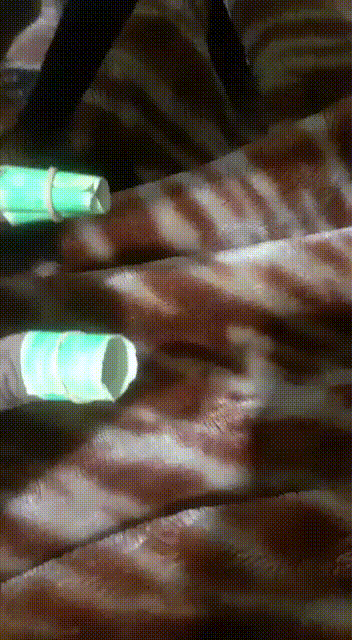
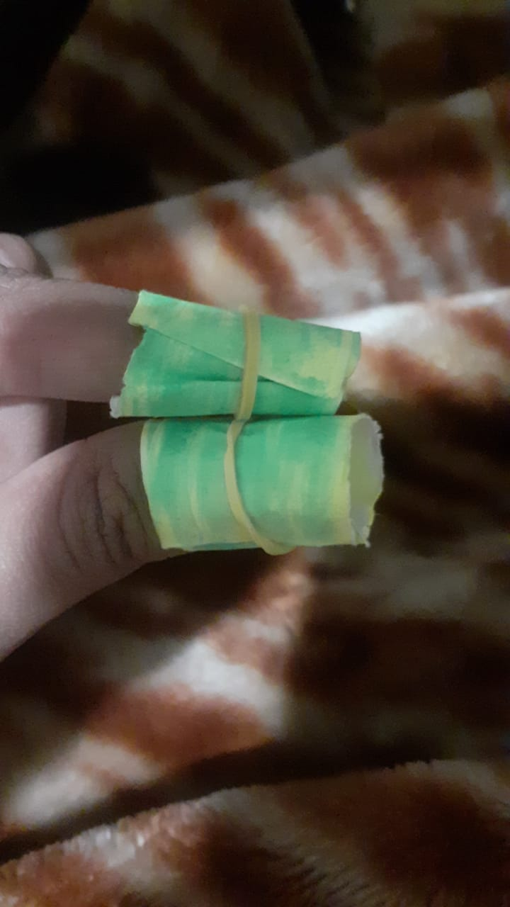
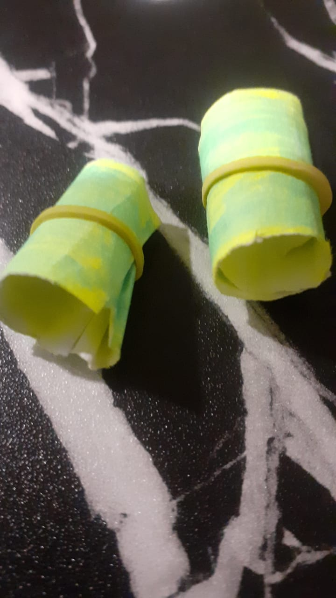

# Gesture-Recognition-Mouse-Using-OpenCV

The project aims at making a gesture based mouse that performs actions as per the gestures made in the camera of the device. The two gestures in consideration are :

Gesture to move mouse pointer|
:---------------------------:|
|

Hold the fingers in this position and move them around to move the mouse pointer along

Gesture to left click|
:-----------------------:|
|

Bring in the fingers close to each other and this is equivalent to pushing and holding the left click button the mouse

### Requirements
1. CV2
2. Numpy
3. Pynput
4. Wx

### Working
The input RGB image is converted into corresponding HSV image with color bounds set for detecting green color(the color of markers). Then detect the number of contours. If the number of contours are 2 the mouse pointer is made to move along the direction of the fingers. If the number of contours is 1 then the mouse pointer imitates a left click. Further a damping factor has been added to ensure smooth mouse pointer movement.  

The markers can be made using a green colored paper and wrapped around the thumb and the index finger for ease of use.

Markers made with paper|
:----------:|
|

### Steps
1. Initialize pynput mouse controller and wx app.
2. Set the camera resolution.
3. The next step is to set the camera width and height.
4. Initialize a damping factor.
5. Run the main loop.
6. Resize the input image and convert RGB to HSV.
7. The next step is to find contours.
8. Then with help of conditionals respective mouse action is done in accordance to the number of contours.

### Running the code
* Open the terminal/cmd in the current working directory.  
* Run the command **python Gesture_Recognition.py** 
